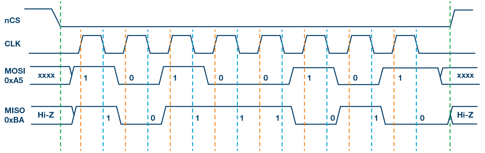
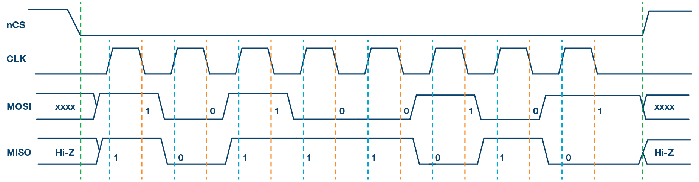
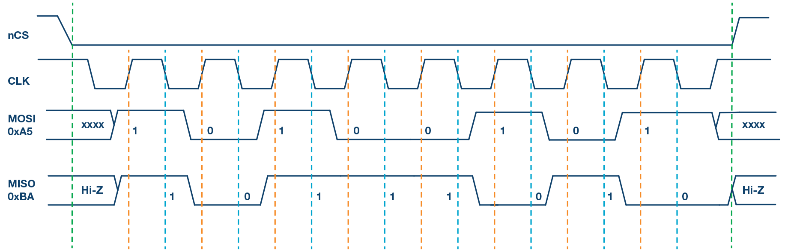

# Timing Diagrams

The following images are sourced from [Analog Devices](https://www.analog.com/en/analog-dialogue/articles/introduction-to-spi-interface.html)

## SPI Mode 0

| MODE=0 | Value | Definition                                      |
| ------ | ----- | ----------------------------------------------- |
| CPOL   | 0     | Clock Idle State = LOW                          |
| CPHA   | 0     | Data Sampled on Rising, Data Shifted on Falling |

## SPI Mode 1

| MODE=1 | Value | Definition                                      |
| ------ | ----- | ----------------------------------------------- |
| CPOL   | 0     | Clock Idle State = LOW                          |
| CPHA   | 1     | Data Sampled on Falling, Data Shifted on Rising |

## SPI Mode 2

| MODE=2 | Value | Definition                                      |
| ------ | ----- | ----------------------------------------------- |
| CPOL   | 1     | Clock Idle State = HIGH                         |
| CPHA   | 0     | Data Sampled on Rising, Data Shifted on Falling |

## SPI Mode 3

| MODE=3 | Value | Definition                                      |
| ------ | ----- | ----------------------------------------------- |
| CPOL   | 1     | Clock Idle State = HIGH                         |
| CPHA   | 1     | Data Sampled on Falling, Data Shifted on Rising |